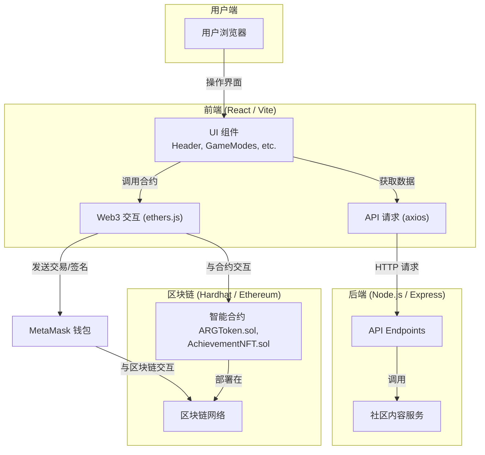

# 认知探索者 (Cognitive Explorer)

本项目是一个基于 Web3 的益智游戏，旨在通过互动的游戏化体验，帮助用户学习和识别各种认知偏误。玩家可以通过挑战关卡、参与社区讨论、赚取项目代币（`ARGToken`）并获得成就 NFT。

## 系统架构

项目采用前后端分离的架构，并与以太坊区块链进行交互。



### 主要技术栈

*   **前端**: `React` + `Vite`，使用 `TailwindCSS` 构建界面，通过 `ethers.js` 与区块链通信。
*   **后端**: `Node.js` + `Express`，主要负责提供动态内容，如社区帖子。
*   **智能合约**: 使用 `Solidity` 编写，包含一个 ERC20 代币 (`ARGToken`) 和一个 ERC721 成就 NFT (`AchievementNFT`)。
*   **开发/测试环境**: `Hardhat` 用于本地部署和测试智能合约。

## 目录结构

*   `contracts/`: 存放所有 Solidity 智能合约源文件。
*   `scripts/`: 存放合约部署脚本。
*   `src/`: 前端应用源代码。
    *   `components/`: React UI 组件。
    *   `contracts/`: 前端与合约交互所需的配置（ABI, 地址等）。
*   `backend/`: 后端服务代码。

## 快速启动

1.  **安装根目录依赖**:
    ```bash
    npm install
    ```

2.  **启动后端服务**:
    ```bash
    cd backend
    npm install
    # 注意：需要根据 server.js 创建并配置 .env 文件
    node server.js
    ```

3.  **启动前端开发服务器**:
    (在项目根目录的新终端中)
    ```bash
    npm run dev
    ```

4.  **部署智能合约**:
    (在项目根目录的新终端中)
    ```bash
    # 启动本地 Hardhat 网络
    npx hardhat node

    # 在另一个终端中部署合约
    npx hardhat run scripts/deploy.js --network localhost
    ``` 